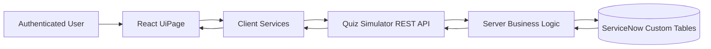
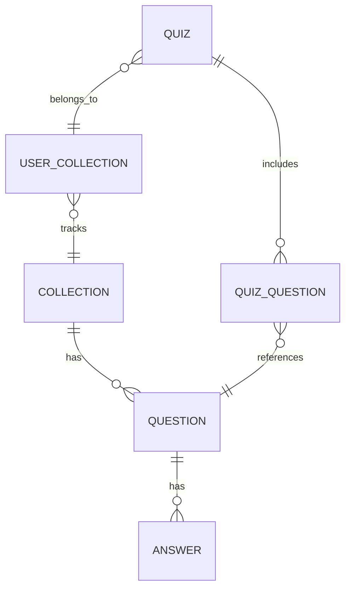

# Quiz Simulator Architecture

## Document Boundary

This document is the source of truth for technical implementation.

- Product scope, business requirements, and acceptance criteria are owned by [PRD.md](PRD.md).
- UI visual and interaction rules are owned by [STYLE.md](STYLE.md).
- Documentation ownership rules are defined in [DOCUMENTATION.md](DOCUMENTATION.md).

## 1. Overview

Quiz Simulator is a ServiceNow Fluent application that combines:

- A React UI (rendered through a ServiceNow UiPage)
- A custom REST API (ServiceNow RestApi + server scripts)
- ServiceNow custom tables for quiz domain persistence

The architecture is intentionally simple and layered: UI -> client service layer -> REST API -> GlideRecord domain logic -> custom tables.

## 2. Architectural Goals

- Keep business logic on the server (data integrity and security).
- Keep frontend focused on rendering, navigation state, and API orchestration.
- Enforce strict ownership checks by current user in quiz flows.
- Support iterative learning through per-user progress lists.

## 3. System Context

- Platform: ServiceNow (Fluent SDK)
- Scope: x_2119443_quiz_sim
- UI entrypoint endpoint: x_2119443_quiz_sim_app.do
- API base path: /api/x_2119443_quiz_sim/quiz_simulator_api

## 4. High-Level Diagram

## 5. Codebase Architecture

## 5.1 Top-Level Structure

- src/client
    - React app, pages, shared UI, API service adapters
- src/server
    - REST API server logic (GlideRecord-based)
- src/fluent
    - ServiceNow metadata declarations: tables, roles, API routes, UI pages, navigation

## 5.2 Frontend Layer

- App shell and route-state orchestration live in app.tsx.
- Pages are component-driven and call dedicated service classes.
- Shared components encapsulate reusable behaviors:
    - interactive table rows
    - loading icon
    - question info tooltip
    - page/section loading title wrappers
- Global visual rules are centralized in styles.css.

## 5.3 Client Service Layer

Frontend uses service classes as API boundary:

- AccessService
- CollectionService
- UserCollectionService
- OpenCollectionService
- QuizService

Responsibilities:

- Build API URLs and query params
- Send X-UserToken header
- Parse API payloads and normalize data for UI
- Convert string-based backend scalar values into frontend booleans/numbers where needed

## 5.4 Backend REST API Layer

The REST API is declared in Fluent and implemented in server TypeScript.

- Route registration: src/fluent/rest-apis/quiz-simulator-api.now.ts
- Business logic: src/server/rest-api/quiz-simulator-api.ts

Implemented route groups:

- Access/roles
- Collections
- Open collection overview
- Quiz lifecycle (create, detail, save-progress, submit)
- Collection publish

## 5.5 Fluent Metadata Layer

Fluent metadata declares platform objects:

- Role: x_2119443_quiz_sim.user
- UiPage endpoint binding
- Application menu and modules
- Custom table schemas
- ACLs for table operations and REST endpoint execution

## 6. Data Architecture

## 6.1 Domain Entities

- collection
    - collection definition (name)
- question
    - belongs to collection, includes type/rationale/docs
- answer
    - belongs to question, contains correctness flag
- user_collection
    - user + collection relation with progress tracking lists
- quiz
    - quiz attempt for user and collection, with status/result
- quiz_question
    - question instance in a quiz with selected answers and grading status

## 6.2 Data Model Diagram

## 6.3 Progress Tracking Strategy

Per-user learning progression is modeled through list fields on user_collection:

- never_seen_questions
- correct_questions
- ever_failed_questions
- last_attempt_failed_questions

On quiz submit, these lists are recalculated incrementally based on exact grading results.

## 7. Runtime Flows

## 7.1 Access Bootstrap

1. App loads.
2. AccessService calls GET /me/roles.
3. UI allows rendering only when role access is confirmed.
4. Any access/bootstrap error routes to Error Page.

## 7.2 Collection Interaction

1. Collections are fetched (all or saved_only).
2. User can save/remove collection via dedicated endpoints.
3. Save initializes never_seen list if needed.
4. Open collection view retrieves stats, groups, questions, and quiz history.

## 7.3 Quiz Lifecycle

1. Create quiz with mode + count.
2. Server samples question ids from mode-specific pool.
3. Client loads quiz detail and current selected answers.
4. Client auto-saves full answer snapshot with debounce.
5. Submit validates completeness, grades exact set equality, closes quiz.
6. Server updates per-user progress lists.

## 7.4 Publish Lifecycle

1. Frontend validates JSON syntax.
2. Backend validates domain contract.
3. Backend creates collection, questions, answers.
4. On failure, backend performs manual rollback in reverse creation order.

## 8. Security Architecture

- Authentication required for API routes.
- Endpoint ACL split:
    - one ACL for authenticated-only role check route
    - one ACL requiring x_2119443_quiz_sim.user role for simulator operations
- Table ACLs enforce role-based create/read/write/delete.
- Server validates ownership on user-sensitive resources:
    - quiz must belong to current user
    - user_collection must match current user + collection
- Client always sends X-UserToken header.

## 9. API Contract Conventions

- Request/response transport: JSON
- Error extraction expected in client: result.error
- Many scalar fields are returned as strings and normalized in frontend services.
- Query parameter names are canonical and explicit:
    - saved_only
    - collection_id
    - quiz_id

## 10. Build and Deployment Architecture

- Build toolchain: now-sdk + isomorphic-rollup plugins
- Prebuild script bundles UI assets into static content directory.
- Dev script runs watch build for client assets.
- Main scripts:
    - npm run dev
    - npm run build
    - npm run deploy
    - npm run transform
    - npm run types

## 11. Error Handling Strategy

- Page-level async errors in UI trigger centralized fallback to Error Page.
- Publish page has additional local inline validation feedback for invalid JSON.
- Backend performs early validation and returns explicit HTTP 4xx for contract issues.

## 12. Performance and UX Considerations

- Auto-save uses debounce to reduce API pressure while preserving progress.
- Contextual controls remain hidden until relevant interaction (hover/focus), reducing visual noise.
- Layout-shift avoidance is applied through reserved icon/action space patterns.
- Quiz question list supports optional scroll-timeline animation with reduced-motion fallback.

## 13. Architectural Constraints

- ServiceNow scope is fixed to x_2119443_quiz_sim.
- Existing table names and prefixes remain tied to quiz_sim scope.
- Business rules are implemented in REST server scripts (no separate domain service package).
- Frontend state management is local React state; no global state library is used.

## 14. Extension Guidelines

- Add new backend capabilities as REST routes first, then consume via client service classes.
- Keep validation and ownership checks on the server side.
- Reuse shared UI components and CSS tokens for visual consistency.
- Preserve canonical API parameter naming and error envelope handling.
- If adding new progress dimensions, evolve user_collection list strategy consistently.
